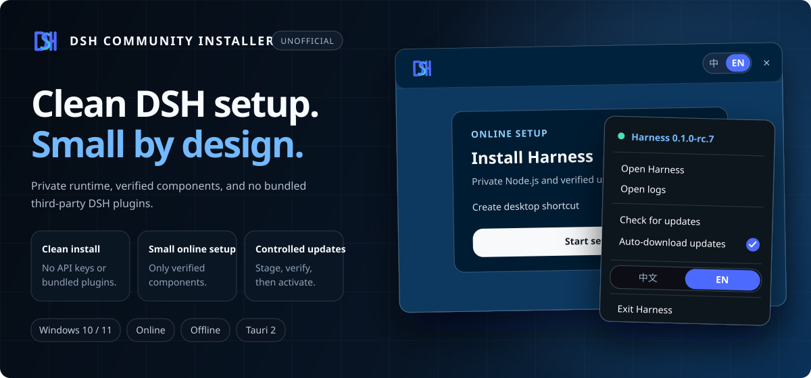

<p align="center">
  <a href="https://github.com/openrect/dsh-community-installer"></a>
</p>

<h1 align="center">DSH Community Installer - Unofficial</h1>

<p align="center">A clean Windows installer and update companion for DeepSeek Harness (DSH), the open-source plugin-based agent harness.</p>

<p align="center">
  <a href="https://github.com/openrect/dsh-community-installer/releases"></a>
  <a href="https://github.com/openrect/dsh-community-installer/releases"></a>
  <a href="https://github.com/openrect/dsh-community-installer/stargazers"></a>
  <a href="LICENSE"></a>
  
</p>

<p align="center"><samp><strong>English</strong> · <a href="README.zh-CN.md">中文</a></samp></p>

<p align="center"></p>

<p align="center"><strong>≈ 3.8 MB online setup · Private Node.js runtime · Official DSH package · Automatic update checks</strong></p>

## DeepSeek Harness, ready on Windows

[DeepSeek Harness](https://deepseek.com/harness/en/) (`dsh`) is DeepSeek AI's open-source, plugin-based agent harness for building and running agents. Models, tools, skills, sessions, sandboxes, storage, loops, scheduling, and the UI are composed as plugins.

The official quick start is `npx @deepseek-ai/dsh web`. This project installs the same official npm package into a private Windows runtime, manages the local service from a lightweight tray, and opens the upstream Web UI in your default browser. It does not change your system Node.js installation or upstream DSH data.

<p align="center">
  <a href="https://deepseek.com/harness/en/"></a>
</p>
<p align="center"><sub>Upstream DeepSeek Harness Web UI · image from the official DeepSeek Harness website</sub></p>

## Why this installer

| | |
| --- | --- |
| **Clean by default** | Installs upstream DSH without API keys or third-party plugins, and leaves the system Node.js installation and `%USERPROFILE%\.dsh` untouched. |
| **Small online setup** | The Windows installer is about 3.8 MB. It uses the system WebView2 runtime and downloads only the pinned runtime components during first setup. |
| **Self-contained runtime** | DSH runs with a private, verified Node.js `24.19.0` environment under `%LOCALAPPDATA%\DSHCommunityInstaller`. |
| **Updates without reinstalling** | Automatic checks are enabled by default. A new version is downloaded only after confirmation, validated separately, and activated without replacing a working version first. |

## Download

| Platform | Edition | Approx. size | Download |
| --- | --- | ---: | --- |
| Windows 10/11 x64 | Online — recommended | 3.8 MB | [DSH-Community-Setup-0.4.6-Windows-x64.exe](https://github.com/openrect/dsh-community-installer/releases/download/v0.4.6/DSH-Community-Setup-0.4.6-Windows-x64.exe) |
| Windows 10/11 x64 | Offline | 95 MB | [DSH-Community-Offline-Setup-0.4.6-Windows-x64.exe](https://github.com/openrect/dsh-community-installer/releases/download/v0.4.6/DSH-Community-Offline-Setup-0.4.6-Windows-x64.exe) |
| macOS | Online | — | Coming soon |
| macOS | Offline | — | Coming soon |

Choose the online edition for normal use. It installs DSH with a private Node.js runtime and pinned pnpm through Corepack. The offline edition carries the same prepared runtime for machines that cannot reach the Node.js distribution or npm registry. Both editions require Microsoft Edge WebView2, which is normally present on Windows 10/11. Sizes are rounded and may change slightly between releases.

## How it works

1. The online setup installs the newest compatible official DSH release from npm. The offline setup imports its pinned runtime seed and can update when it later has network access.
2. The lightweight Tauri tray starts Harness only on `127.0.0.1:3080`, captures logs, and opens the upstream interface in the default browser.
3. Update checks distinguish installer releases from DSH releases. After confirmation, DSH is installed in a fresh directory, validated, and atomically activated with rollback on failure.

The tray also provides English/Chinese switching, logs, manual update checks, and a single clear exit action. Uninstall removes the private runtime and logs while preserving upstream DSH settings and sessions.

## Automatic updates, under your control

- **Automatic checks:** enabled by default and run when Harness starts; the tray also offers a manual check at any time.
- **Future DSH releases:** checks the official npm `latest` and `next` channels and selects the highest version compatible with the bundled Node.js runtime.
- **No silent installation:** when an update is available, the installer asks first and starts the download only after confirmation.
- **Safe activation:** the new DSH version is installed with private pnpm, shown with live progress, validated, and then switched atomically. A failed candidate leaves the current version available.
- **Installer updates:** the Windows controller checks its own signed update feed separately from upstream DSH updates.

This makes the project both a DeepSeek Harness Windows installer and a small DSH update manager; routine upstream releases do not require downloading the full installer again.

## Project status

> [!IMPORTANT]
> This is an unofficial community project. It is not affiliated with, authorized by, or endorsed by DeepSeek. `DSH`, `DeepSeek Harness`, and `@deepseek-ai/dsh` identify the compatible upstream software.

> [!WARNING]
> Windows builds are currently unsigned. SmartScreen may show an unknown-publisher warning. Verify the SHA-256 supplied with the GitHub Release; do not disable SmartScreen or security software.

## Build

Install Node.js, pnpm, the Rust MSVC toolchain, and the Windows build tools, then run:

```powershell
pnpm install --frozen-lockfile
pnpm build:online
pnpm build:offline
```

`pnpm test` runs the frontend and Rust tests plus release consistency checks. `pnpm release` prepares both installers, SHA-256 files, and signed Tauri updater artifacts.

## License

[MIT](LICENSE). Upstream components retain their own licenses; see [third-party notices](THIRD_PARTY_NOTICES.txt) and [security policy](SECURITY.md).
